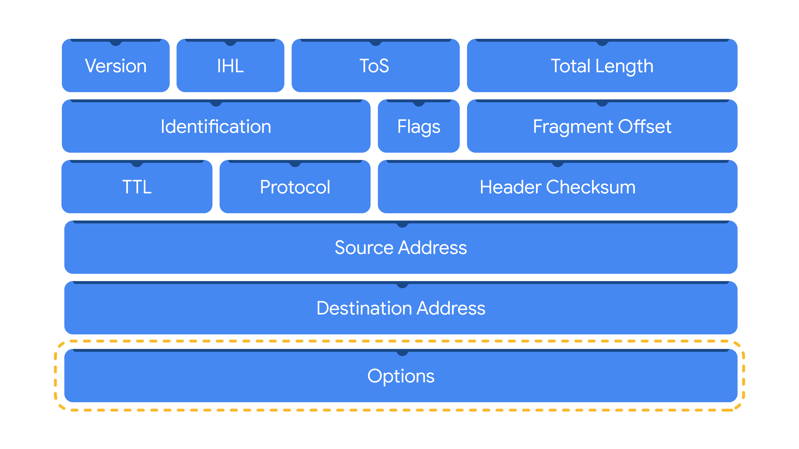
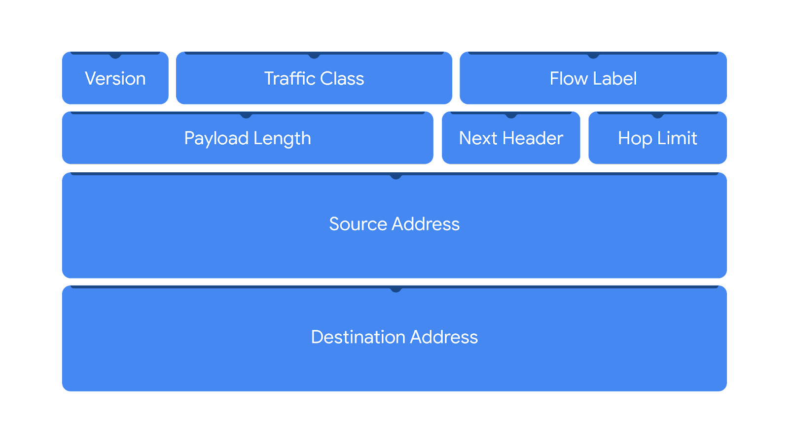
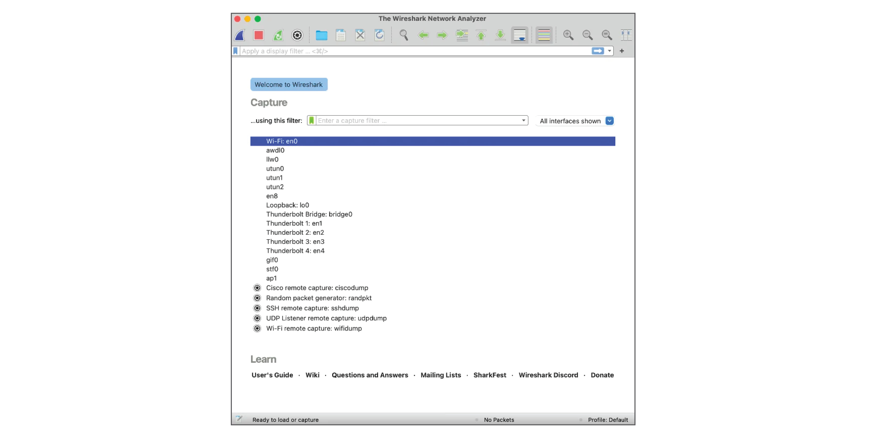
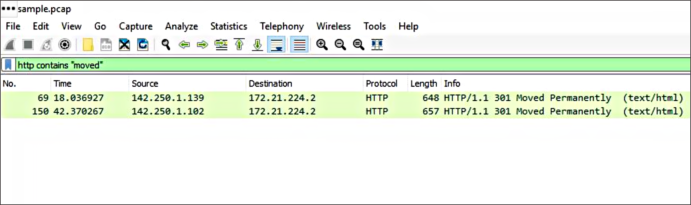
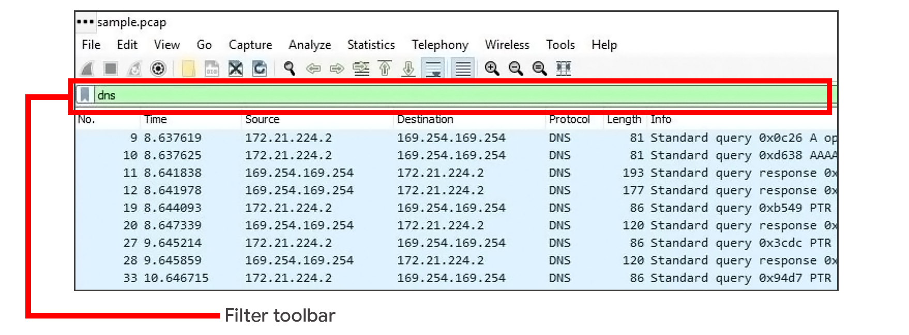
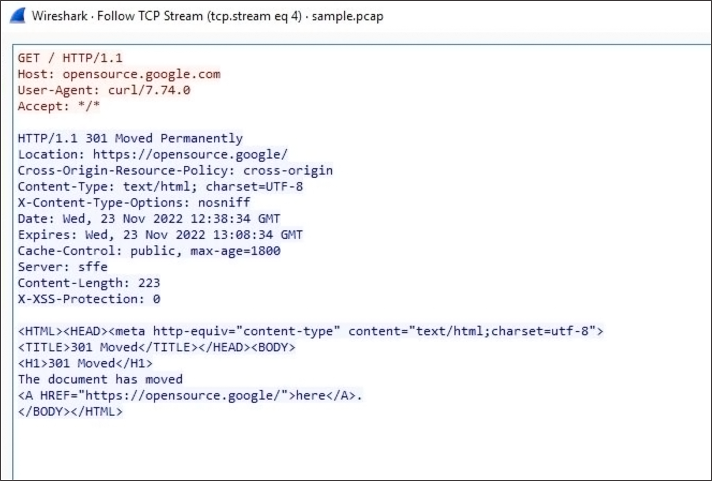

# Maintain awareness with network monitoring
Network communication can be noisy! Events like sending an email, streaming a video, or visiting a website all produce network communications in the form of network traffic and network data. As a reminder, **network traffic** is the amount of data that moves across a network. It can also include the type of data that is transferred, such as HTTP. **Network data** is the data that's transmitted between devices on a network.

Network monitoring is essential in maintaining situational awareness of any activity on a network. By collecting and analyzing network traffic, organizations can detect suspicious network activity. But before networks can be monitored, you must know exactly what to monitor. In this reading, you'll learn more about the importance of network monitoring, ways to monitor your network, and network monitoring tools.

## Know your network
As you’ve learned, networks connect devices, and devices then communicate and exchange data using network protocols. Network communications provide information about connections such as source and destination IP addresses, amount of data transferred, date and time, and more. This information can be valuable for security professionals when developing a **baseline** of normal or expected behavior. 

A baseline is a reference point that’s used for comparison. You've probably encountered or used baselines at some point. For example, a grocery amount for a personal budget is an example of a baseline that can be used to help identify any patterns or changes in spending habits. In security, baselines help establish a standard of expected or normal behavior for systems, devices, and networks. Essentially, by knowing the baseline of normal network behavior, you'll be better able to identify abnormal network behavior.

## Monitor your network
Once you’ve determined a baseline, you can monitor a network to identify any deviations from that baseline. Monitoring involves examining network components to detect unusual activities, such as large and unusual data transfers. Here are examples of network components that can be monitored to detect malicious activity:

### Flow analysis
Flow refers to the movement of network communications and includes information related to packets, protocols, and ports. Packets can travel to ports, which receive and transmit communications. Ports are often, but not always, associated with network protocols. For example, port 443 is commonly used by HTTPS which is a protocol that provides website traffic encryption.

However, malicious actors can use protocols and ports that are not commonly associated to maintain communications between the compromised system and their own machine. These communications are what’s known as **command and control (C2)**, which are the techniques used by malicious actors to maintain communications with compromised systems.

For example, malicious actors can use HTTPS protocol over port 8088 as opposed to its commonly associated port 443 to communicate with compromised systems. Organizations must know which ports should be open and approved for connections, and watch out for any mismatches between ports and their associated protocols.

## Packet payload information
Network packets contain components related to the transmission of the packet. This includes details like source and destination IP address, and the packet payload information, which is the actual data that’s transmitted. Often, this data is encrypted and requires decryption for it to be readable. Organizations can monitor the payload information of packets to uncover unusual activity, such as sensitive data transmitting outside of the network, which could indicate a possible data exfiltration attack.

## Temporal patterns
Network packets contain information relating to time. This information is useful in understanding time patterns. For example, a company operating in North America experiences bulk traffic flows between 9 a.m. to 5 p.m., which is the baseline of normal network activity. If large volumes of traffic are suddenly outside of the normal hours of network activity, then this is considered off baseline and should be investigated.

Through network monitoring, organizations can promptly detect network intrusions and work to prevent them from happening by securing network components.

## Protect your network
In this program, you’ve learned about **security operations centers (SOC)** and their role in monitoring systems against security threats and attacks. Organizations may deploy a **network operations center (NOC)**, which is an organizational unit that monitors the performance of a network and responds to any network disruption, such as a network outage. While a SOC is focused on maintaining the security of an organization through detection and response, a NOC is responsible for maintaining network performance, availability, and uptime. 

An analyst monitors system activity on multiple computer screens.
Security analysts monitor networks to identify any signs of potential security incidents known as **indicators of compromise (IoC)** and  protect networks from threats or attacks. To do this, they must understand the environment that network communications travel through so that they can identify deviations in network traffic. 

## Network monitoring tools
Network monitoring can be automated or performed manually. Some common network monitoring tools can include: 

- **Intrusion detection systems (IDS)** monitor system activity and alert on possible intrusions. An IDS will detect and alert on the deviations you’ve configured it to detect. Most commonly, IDS tools will monitor the content of packet payload to detect patterns associated with threats such as malware or phishing attempts.

- **Network protocol analyzers**, also known as packet sniffers, are tools designed to capture and analyze data traffic within a network. They can be used to analyze network communications manually in detail. Examples include tools such as tcpdump and Wireshark, which can be used by security professionals to record network communications through packet captures. Packet captures can then be investigated to identify potentially malicious activity.

## Key takeaways
Monitoring and protecting networks from intrusions and attacks are key responsibilities of security professionals. You can’t protect what you don’t know. As a security analyst, you’ll need to know the components of a network and the communications that happen on it, so  you can better protect it. Baselines provide a way to understand network traffic by uncovering common patterns which help in identifying any deviations from the expected traffic patterns. Tools like intrusion detection systems and network protocol analyzers support efforts in monitoring network activities.

## Resources
If you would like to learn more about network components organizations can monitor, check out 
[network traffic - MITRE ATT&CK®](https://attack.mitre.org/datasources/DS0029/)

Attackers can leverage different techniques to exfiltrate data, should you like to learn more, check out 
[data exfiltration techniques - MITRE ATT&CK®](https://attack.mitre.org/tactics/TA0010/)

---

# Learn more about packet captures
The role of security analysts involves monitoring and analyzing network traffic flows. One way to do this is by generating packet captures and then analyzing the captured traffic to identify unusual activity on a network.

Previously, you explored the fundamentals of networks. Throughout this section, you’ll refer to your foundation in networking to better understand network traffic flows. In this reading, you'll learn about the three main aspects of network analysis: packets, network protocol analyzers, and packet captures.

## Packets
Previously in the program, you learned that a **data packet** is a basic unit of information that travels from one device to another within a network. Detecting network intrusions begins at the packet level. That's because packets form the basis of information exchange over a network. Each time you perform an activity on the internet—like visiting a website—packets are sent and received between your computer and the website’s server. These packets are what help transmit information through a network. For example, when uploading an image to a website, the data gets broken up into multiple packets, which then get routed to the intended destination and reassembled upon delivery. 

In cybersecurity, packets provide valuable information that helps add context to events during investigations. Understanding the transfer of information through packets will not only help you develop insight on network activity, it will also help you identify abnormalities and better defend networks from attacks.

Packets contain three components: the header, the payload, and the footer. Here’s a description of each of these components.

## Header
Packets begin with the most essential component: the header. Packets can have several headers depending on the protocols used such as an Ethernet header, an IP header, a TCP header, and more. Headers provide information that’s used to route packets to their destination. This includes information about the source and destination IP addresses, packet length, protocol, packet identification numbers, and more. 

Here is an IPv4 header with the information it provides:

## Payload
The payload component directly follows the header and contains the actual data being delivered. Think back to the example of uploading an image to a website; the payload of this packet would be the image itself.

## Footer
The footer, also known as the trailer, is located at the end of a packet. The Ethernet protocol uses footers to provide error-checking information to determine if data has been corrupted. In addition, Ethernet network packets that are analyzed might not display footer information due to network configurations.

**Note**: Most protocols, such as the Internet Protocol (IP), do not use footers. 

## Network protocol analyzers
**Network protocol analyzers (packet sniffers)** are tools designed to capture and analyze data traffic within a network. Examples of network protocol analyzers include tcpdump, Wireshark, and TShark. 

Beyond their use in security as an investigative tool used to monitor networks and identify suspicious activity, network protocol analyzers can be used to collect network statistics, such as bandwidth or speed, and troubleshoot network performance issues, like slowdowns. 

Network protocol analyzers can also be used for malicious purposes. For example, malicious actors can use network protocol analyzers to capture packets containing sensitive data, such as account login information.

Here’s a network diagram illustrating how packets get transmitted from a sender to the receiver. A network protocol analyzer is placed in the middle of the communications to capture the data packets that travel over the wire.

## How network protocol analyzers work
Network protocol analyzers use both software and hardware capabilities to capture network traffic and display it for security analysts to examine and analyze. Here’s how:

1. First, packets must be collected from the network via the **Network Interface Card (NIC)**, which is hardware that connects computers to a network, like a router. NICs receive and transmit network traffic, but by default they only listen to network traffic that’s addressed to them. To capture all network traffic that is sent over the network, a NIC must be switched to a mode that has access to all visible network data packets. In wireless interfaces this is often referred to as monitoring mode, and in other systems it may be called promiscuous mode. This mode enables the NIC to have access to all visible network data packets, but it won’t help analysts access all packets across a network. A network protocol analyzer must be positioned in an appropriate network segment to access all traffic between different hosts. 

2. The network protocol analyzer collects the network traffic in raw binary format. Binary format consists of 0s and 1s and is not as easy for humans to interpret. The network protocol analyzer takes the binary and converts it so that it’s displayed in a human-readable format, so analysts can easily read and understand the information.  

## Capturing packets
**Packet sniffing** is the practice of capturing and inspecting data packets across a network. A **packet capture (p-cap)** is a file containing data packets intercepted from an interface or network. Packet captures can be viewed and further analyzed using network protocol analyzers. For example, you can filter packet captures to only display information that's most relevant to your investigation, such as packets sent from a specific IP address.

**Note**: Using network protocol analyzers to intercept and examine private network communications without permission is considered illegal in many places.

P-cap files can come in many formats depending on the packet capture library that’s used. Each format has different uses and network tools may use or support specific packet capture file formats by default. You should be familiar with the following libraries and formats:

1. **Libpcap** is a packet capture library designed to be used by Unix-like systems, like Linux and MacOS®. Tools like tcpdump use Libpcap as the default packet capture file format. 

2. **WinPcap** is an open-source packet capture library designed for devices running Windows operating systems. It’s considered an older file format and isn’t predominantly used.

3. **Npcap** is a library designed by the port scanning tool Nmap that is commonly used in Windows operating systems.

4. **PCAPng** is a modern file format that can simultaneously capture packets and store data. Its ability to do both explains the “ng,” which stands for “next generation.”

**Pro tip**: Analyzing your home network can be a good way to practice using these tools.

## Key takeaways
Network protocol analyzers are helpful investigative tools that provide you with insight into the activity happening on a network. As an analyst, you'll use network protocol analyzer tools to view and analyze packet capture files to better understand network communications and defend against intrusions.

## Resources for more information
This Infosec article describes the risks of 
[packet crafting](https://resources.infosecinstitute.com/topic/packet-crafting-a-serious-crime/), a technique used to test a network’s structure.

---

# Investigate packet details
So far, you've learned about how network protocol analyzers (packet sniffers) intercept network communications. You've also learned how you can analyze packet captures (p-caps) to gain insight into the activity happening on a network. As a security analyst, you'll use your packet analysis skills to inspect network packets and identify suspicious activity during investigations. 

In this reading, you'll re-examine IPv4 and IPv6 headers. Then, you'll explore how you can use Wireshark to investigate the details of packet capture files. 

## Internet Protocol (IP)
Packets form the foundation of data exchange over a network, which means that detection begins at the packet level. The **Internet Protocol (IP)** includes a set of standards used for routing and addressing data packets as they travel between devices on a network. IP operates as the foundation for all communications over the internet.

IP ensures that packets reach their destinations. There are two versions of IP that you will find in use today: IPv4 and IPv6. Both versions use different headers to structure packet information. 

## IPv4
IPv4 is the most commonly used version of IP. There are thirteen fields in the header:

- **Version**: This field indicates the IP version. For an IPv4 header, IPv4 is used. 

- **Internet Header Length (IHL)**: This field specifies the length of the IPv4 header including any Options.

- **Type of Service (ToS)**: This field provides information about packet priority for delivery.

- **Total Length**: This field specifies the total length of the entire IP packet including the header and the data.

- **Identification**: Packets that are too large to send are fragmented into smaller pieces. This field specifies a unique identifier for fragments of an original IP packet so that they can be reassembled once they reach their destination.

- **Flags**: This field provides information about packet fragmentation including whether the original packet has been fragmented and if there are more fragments in transit.

- **Fragment Offset**: This field is used to identify the correct sequence of fragments.

- **Time to Live (TTL)**: This field limits how long a packet can be circulated in a network, preventing packets from being forwarded by routers indefinitely.

- **Protocol**: This field specifies the protocol used for the data portion of the packet.

- **Header Checksum**: This field specifies a checksum value which is used for error-checking the header.

- **Source Address**: This field specifies the source address of the sender.

- **Destination Address**: This field specifies the destination address of the receiver.

- **Options**: This field is optional and can be used to apply security options to a packet.

## IPv6
IPv6 adoption has been increasing because of its large address space. There are eight fields in the header:

- **Version**: This field indicates the IP version. For an IPv6 header, IPv6 is used.

- **Traffic Class**: This field is similar to the IPv4 Type of Service field. The Traffic Class field provides information about the packet's priority or class to help with packet delivery.

- **Flow Label**: This field identifies the packets of a flow. A flow is the sequence of packets sent from a specific source. 

- **Payload Length**: This field specifies the length of the data portion of the packet.

- **Next Header**: This field indicates the type of header that follows the IPv6 header such as TCP.

- **Hop Limit**: This field is similar to the IPv4 Time to Live field. The Hop Limit limits how long a packet can travel in a network before being discarded.

- **Source Address**: This field specifies the source address of the sender.

- **Destination Address**: This field specifies the destination address of the receiver.

Header fields contain valuable information for investigations and tools like Wireshark help to display these fields in a human-readable format.

## Wireshark
Wireshark is an open-source network protocol analyzer. It uses a graphical user interface (GUI), which makes it easier to visualize network communications for packet analysis purposes. Wireshark has many features to explore that are beyond the scope of this course. You'll focus on how to use basic filtering to isolate network packets so that you can find what you need.

## Display filters
Wireshark's display filters let you apply filters to packet capture files. This is helpful when you are inspecting packet captures with large volumes of information. Display filters will help you find specific information that's most relevant to your investigation. You can filter packets based on information such as protocols, IP addresses, ports, and virtually any other property found in a packet. Here, you'll focus on display filtering syntax and filtering for protocols, IP addresses, and ports.

## Comparison operators
You can use different comparison operators to locate specific header fields and values. Comparison operators can be expressed using either abbreviations or symbols. For example, this filter using the **==** equal symbol in this filter **ip.src == 8.8.8.8** is identical to using the **eq** abbreviation in this filter **ip.src eq 8.8.8.8.**

This table summarizes the different types of comparison operators you can use for display filtering.

| Operator type               | Symbol | Abbreviation |
|-----------------------------|--------|--------------|
| Equal                       | ==     | eq           |
| Not equal                   | !=     | ne           |
| Greater than                | >      | gt           |
| Less than                   | <      | lt           |
| Greater than or equal to    | >=     | ge           |
| Less than or equal to       | <=     | le           |

**Pro tip**: You can combine comparison operators with Boolean logical operators like and and or to create complex display filters. Parentheses can also be used to group expressions and to prioritize search terms.

## Contains operator
The **contains** operator is used to filter packets that contain an exact match of a string of text. Here is an example of a filter that displays all HTTP streams that match the keyword **"moved"**. 

## Matches operator
The matches operator is used to filter packets based on the regular expression (regex) that's specified. Regular expression is a sequence of characters that forms a pattern. You'll explore more about regular expressions later in this program. 

## Filter toolbar
You can apply filters to a packet capture using Wireshark's filter toolbar. In this example, dns is the applied filter, which means Wireshark will only display packets containing the DNS protocol.

**Pro tip**: Wireshark uses different colors to represent protocols. You can customize colors and create your own filters.

## Filter for protocols
Protocol filtering is one of the simplest ways you can use display filters. You can simply enter the name of the protocol to filter. For example, to filter for DNS packets simply type **dns** in the filter toolbar. Here is a list of some protocols you can filter for:

- dns

- http

- ftp

- ssh

- arp

- telnet

- icmp

## Filter for an IP address
You can use display filters to locate packets with a specific IP address. 

For example, if you would like to filter packets that contain a specific IP address use **ip.addr**, followed by a space, the equal **==** comparison operator, and the IP address. Here is an example of a display filter that filters for the IP address **172.21.224.2**:

**ip.addr == 172.21.224.2**

To filter for packets originating from a specific source IP address, you can use the **ip.src** filter. Here is an example that looks for the **10.10.10.10** source IP address:

**ip.src == 10.10.10.10**

To filter for packets delivered to a specific destination IP address, you can use the **ip.dst** filter. Here is an example that searches for the **4.4.4.4** destination IP address:

**ip.dst == 4.4.4.4**

## Filter for a MAC address
You can also filter packets according to the **Media Access Control (MAC) address**. As a refresher, a MAC address is a unique alphanumeric identifier that is assigned to each physical device on a network.

Here's an example:

**eth.addr == 00:70:f4:23:18:c4**

## Filter for ports
Port filtering is used to filter packets based on port numbers. This is helpful when you want to isolate specific types of traffic. DNS traffic uses TCP or UDP port 53 so this will list traffic related to DNS queries and responses only.

For example, if you would like to filter for a UDP port:

**udp.port == 53**

Likewise, you can filter for TCP ports as well:

**tcp.port == 25**

## Follow streams
Wireshark provides a feature that lets you filter for packets specific to a protocol and view streams. A stream or conversation is the exchange of data between devices using a protocol. Wireshark reassembles the data that was transferred in the stream in a way that's simple to read.

Following a protocol stream is useful when trying to understand the details of a conversation. For example, you can examine the details of an HTTP conversation to view the content of the exchanged request and response messages.

## Key takeaways
In this reading, you explored basic display filters with Wireshark. Packet analysis is an essential skill that you will continue to develop over time in your cybersecurity journey. Put your skills to practice in the upcoming activity and explore investigating the details of a packet capture file using Wireshark!

## Resources
To learn more about Wireshark's full features and capabilities, explore the [Wireshark official user guide](https://www.wireshark.org/docs/wsug_html/)